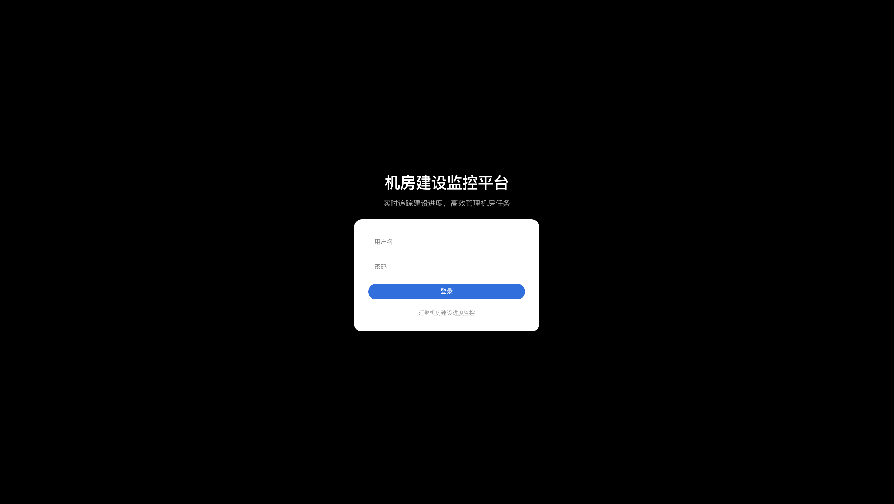
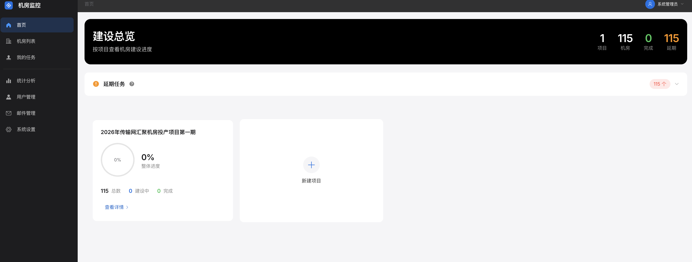
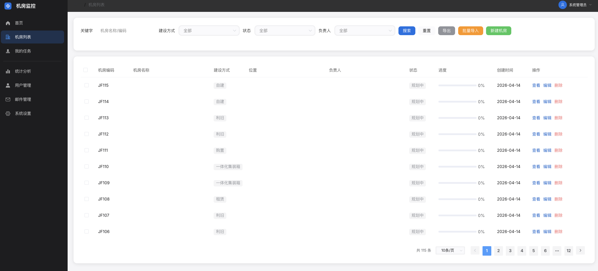

# 汇聚机房建设进度监控平台

## 项目简介

本系统用于监控汇聚机房从立项到投用的全流程建设进度，支持管理员和机房负责人两类用户角色。

## 界面展示

### 首页总览



首页以项目卡片形式展示各项目整体进度，支持快速查看延期预警。

### 项目详情



项目详情页按负责人分组展示机房，可展开查看各机房具体进度。

### 机房详情



机房详情页展示建设流程网络图、任务进度对比分析、时间统计等信息。

## 技术栈

- **后端**: Express + PostgreSQL + Sequelize
- **前端**: Vue 2 + Element UI + Vuex + Vue Router
- **数据库**: PostgreSQL 15（Docker 容器）

## 功能模块

1. **用户管理**: 管理员可创建用户、分配角色、重置密码
2. **机房管理**: 创建机房、分配负责人、绑定项目、查看进度、变更记录
3. **任务管理**: 机房负责人更新任务状态和进度
4. **统计分析**: 项目卡片总览、负责人分组明细、延期预警
5. **邮件通知**: 定时邮件任务、支持选择负责人或自定义邮箱
6. **项目管理**: 项目创建、归档（含机房时不可删除）

## 建设流程（6 个阶段）

1. 立项批复
2. 合同签订
3. 设计批复
4. 物资到货
5. 施工作业
6. 竣工投用

---

## 部署流程

### 环境要求

- Node.js 16+
- PostgreSQL 15+（或使用 Docker）
- Docker & Docker Compose（可选，用于 PostgreSQL）

### 步骤一：克隆项目

```bash
git clone <repository-url>
cd JIFANG-jianshe
```

### 步骤二：配置环境变量

```bash
cp .env.example .env
```

编辑 `.env` 文件，**必须修改以下配置**：

| 配置项 | 示例值 | 说明 |
|--------|--------|------|
| `JWT_SECRET` | `your-random-secret-key-16chars` | JWT 密钥，至少16位随机字符串 |
| `JWT_EXPIRES_IN` | `12h` | 登录状态有效期 |
| `DB_HOST` | `localhost` | 数据库地址 |
| `DB_PORT` | `5432` | 数据库端口 |
| `DB_NAME` | `jifang_jianshe` | 数据库名称 |
| `DB_USER` | `root` | 数据库用户名 |
| `DB_PASSWORD` | `root123` | 数据库密码 |

⚠️ **生产环境必须修改 `JWT_SECRET` 为强随机密钥！**

### 步骤三：启动数据库

**方式一：使用 Docker（推荐）**

```bash
docker-compose up -d postgres

# 等待数据库启动完成
docker-compose logs -f postgres
# 看到 "database system is ready to accept connections" 后按 Ctrl+C 退出
```

**方式二：使用现有 PostgreSQL**

```sql
-- 在 PostgreSQL 中创建数据库
CREATE DATABASE jifang_jianshe;
```

### 步骤四：初始化后端

```bash
cd backend
npm install

# 初始化数据库（首次部署必须执行，会创建表结构和默认数据）
npm run init-db

# 启动后端服务
npm run dev
```

后端默认运行在 `http://localhost:3000`

⚠️ **重要提示**：
- `npm run init-db` 会**重建所有表**，适合首次部署或重置环境
- 已有业务数据的环境请使用 `npm run sync-tables`（增量同步表结构）

### 步骤五：启动前端

```bash
cd frontend
npm install
npm run serve
```

前端默认运行在 `http://localhost:8080`

### 步骤六：访问系统

打开浏览器访问 `http://localhost:8080`

| 用户名 | 密码 | 角色 |
|--------|------|------|
| admin | admin123 | 管理员 |
| manager1 | 123456 | 机房负责人 |
| manager2 | 123456 | 机房负责人 |

⚠️ **生产环境请修改默认密码！**

---

## 常用命令

```bash
# 启动数据库
docker-compose up -d postgres

# 停止数据库
docker-compose stop postgres

# 查看容器状态
docker-compose ps

# 进入 PostgreSQL 命令行
docker exec -it jifang-postgres psql -U root -d jifang_jianshe

# 初始化数据库（首次部署/重置）
cd backend && npm run init-db

# 同步表结构（已有数据环境升级）
cd backend && npm run sync-tables

# 删除容器和数据卷（危险操作，会清空数据）
docker-compose down -v
```

---

## 生产部署

### 前端构建

```bash
cd frontend
npm run build
```

生成的静态文件在 `frontend/dist/`，部署到 Nginx 或其他静态服务器。

### 后端启动

```bash
cd backend
npm start    # 生产模式（使用 node 而非 nodemon）
```

### 生产环境配置建议

1. **修改 JWT_SECRET**：使用强随机密钥
2. **修改默认密码**：admin、manager1、manager2
3. **关闭 Swagger**：`SWAGGER_ENABLED=false`
4. **配置 CORS**：`CORS_ALLOWED_ORIGINS=https://your-domain.com`
5. **配置邮件 SMTP**：设置 EMAIL 相关参数
6. **使用 HTTPS**：前端和后端都配置 SSL

---

## 版本升级

从旧版本升级时，执行表结构同步：

```bash
cd backend
npm run sync-tables
```

这会同步新增的表和字段，**不删除已有数据**。

---

## 数据库表结构

| 表名 | 说明 | 时间戳字段 |
|------|------|------------|
| users | 用户表 | created_at, updated_at |
| projects | 项目表 | created_at, updated_at |
| machine_rooms | 机房表 | created_at, updated_at |
| room_change_logs | 变更记录 | created_at |
| construction_phases | 建设阶段 | created_at, updated_at |
| task_templates | 任务模板 | created_at, updated_at |
| task_dependencies | 任务依赖 | created_at, updated_at |
| room_tasks | 机房任务 | created_at, updated_at |
| task_progress_logs | 进度日志 | created_at |
| operation_logs | 操作日志 | created_at |
| email_tasks | 件任务 | created_at, updated_at |
| email_logs | 邮件日志 | created_at |
| system_configs | 系统配置 | created_at, updated_at |

---

## 界面说明

### 首页（建设总览）
- 以**项目卡片**展示各项目进度
- 点击卡片进入项目详情
- 管理员可新建项目

### 项目详情页
- 延期任务预警（超过计划日期未完成）
- 按**负责人分组**展示机房，点击展开明细

### 机房管理
- 创建机房需选择所属项目
- 支持批量删除、批量导入
- 变更自动记录历史

### 件管理
- 接收人可选择负责人或自定义邮箱
- 支持单次/每日/每周/每月发送

---

## 故障排查

### 数据库表不存在/字段错误

```bash
cd backend
npm run sync-tables    # 同步表结构
```

### Token 无效/登录状态异常

1. 检查 `.env` 中 `JWT_SECRET` 是否正确
2. 检查 `JWT_EXPIRES_IN` 配置
3. 清除浏览器 localStorage 后重新登录

### 数据库连接失败

1. 确认 PostgreSQL 已启动：`docker-compose ps`
2. 检查 `.env` 中的数据库配置
3. 确认数据库已创建

### 后端启动失败

1. 检查 Node.js 版本是否 >= 16
2. 检查依赖是否安装：`npm install`
3. 检查 `.env` 文件是否存在且配置正确

---

## 项目结构

```text
JIFANG-jianshe/
├── .env.example           # 环境变量示例
├── .gitignore             # Git 忽略配置
├── docker-compose.yml     # PostgreSQL 容器配置
├── README.md              # 项目说明
│
├── backend/               # 后端项目
│   ├── config/            # 运行配置
│   ├── controllers/       # 控制器
│   ├── middleware/        # 中间件
│   ├── models/            # 数据模型
│   ├── routes/            # 路由
│   ├── scripts/           # 初始化脚本
│   │   ├── initDatabase.js    # 全量初始化
│   │   └── syncTables.js      # 增量同步
│   ├── utils/             # 工具函数
│   ├── server.js          # 启动入口
│   └── package.json       # 依赖配置
│
├── frontend/              # 前端项目
│   ├── src/
│   │   ├── api/           # API 接口
│   │   ├── components/    # 公共组件
│   │   ├── views/         # 页面组件
│   │   ├── store/         # Vuex 状态管理
│   │   ├── router/        # 路由配置
│   │   └ utils/           # 工具函数
│   │   └ App.vue          # 根组件
│   │   └ main.js          # 入口文件
│   ├── vue.config.js      # Vue CLI 配置
│   └ package.json         # 依赖配置
│
└── database/              # 数据库相关
    └ init/                # 初始化脚本目录
```